# Medical Image Classification Projects

Machine Learning and Deep Learning projects for medical image classification using SVM, CNN, PCA, Transfer Learning and XGBoost.

---

# Exercise-1: Brain Tumor Detection using SVM + PCA

## Project Description

The objective of this project is to classify MRI brain scans into:

* No Tumor
* Pituitary Tumor
* Glioma Tumor
* Meningioma Tumor

### Method Used

* Image preprocessing
* Image normalization
* PCA dimensionality reduction
* Support Vector Machine (SVM)

---

## Project Files

### Code

[View Notebook on GitHub](https://github.com/Kash-Yep/Medical-Image-Classification-Projects/blob/main/Exersize-1%28BrainTumour-SVM%29/Code/Brain.ipynb)

---

# Results

# Baseline SVM (RBF Kernel)

## Training and Testing Scores

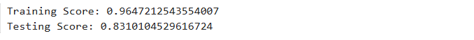

---

## Tumor Count

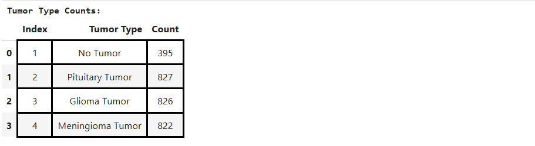

---

## Sample Predictions

### Prediction Set 1

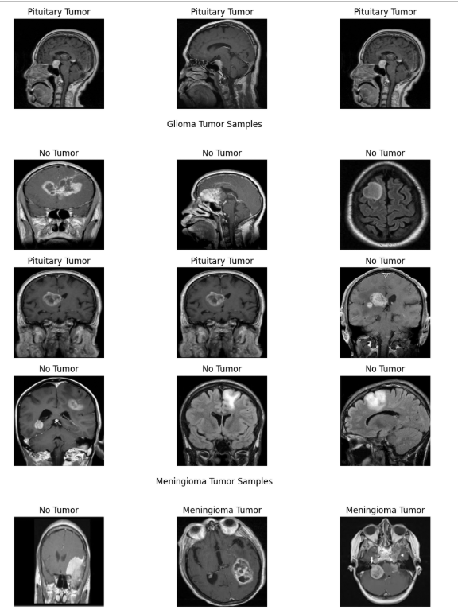

### Prediction Set 2

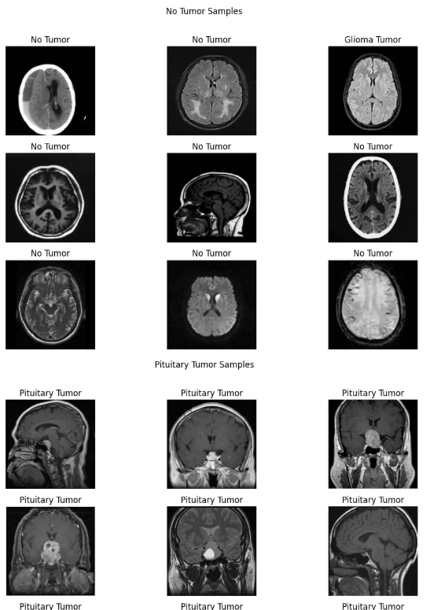

---

## Histogram

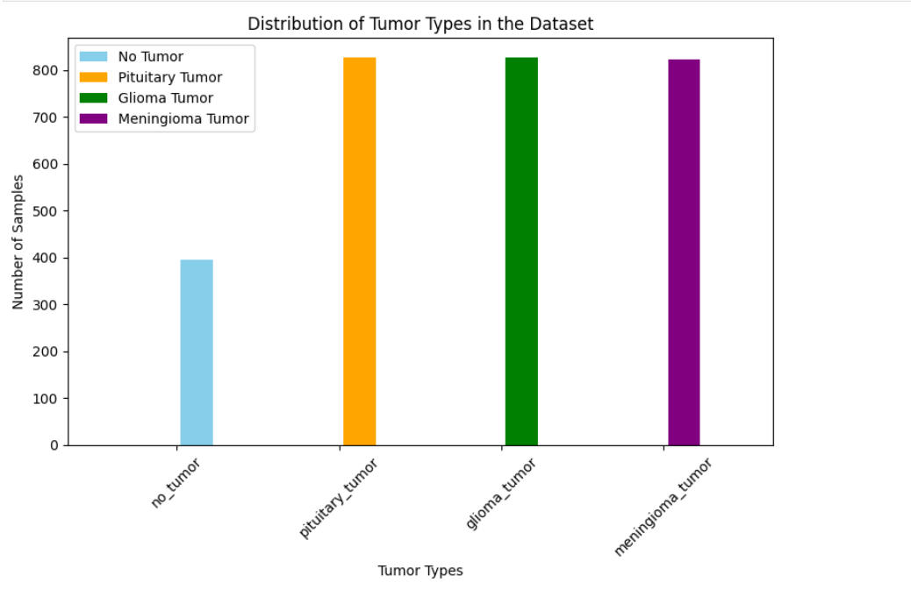

---

# Linear Kernel Experiment

## Training and Testing Scores

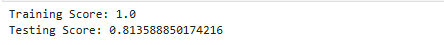

---

## Tumor Count

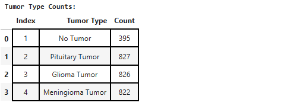

---

## Sample Predictions

### Prediction Set 1

### Prediction Set 2

### Prediction Set 3

### Prediction Set 4

---

## Histogram

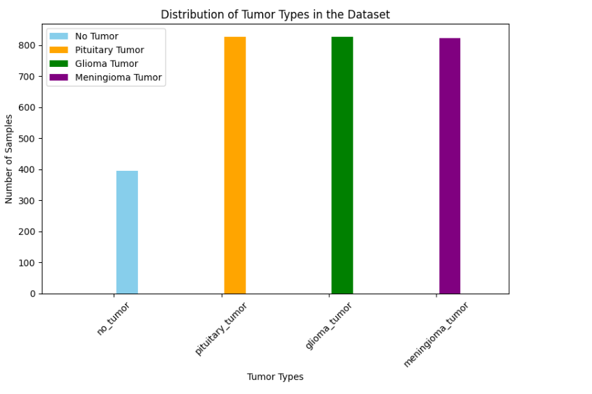

---

# Training Percentage Experiment

## Training and Testing Scores

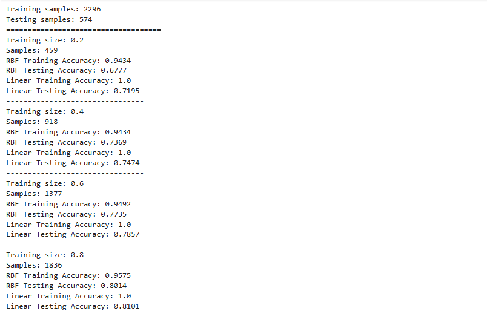

---

## Tumor Count

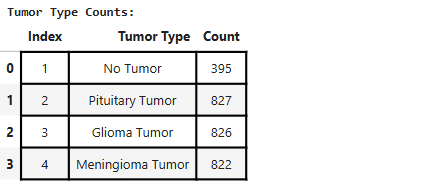

---

## Training vs Accuracy Plot

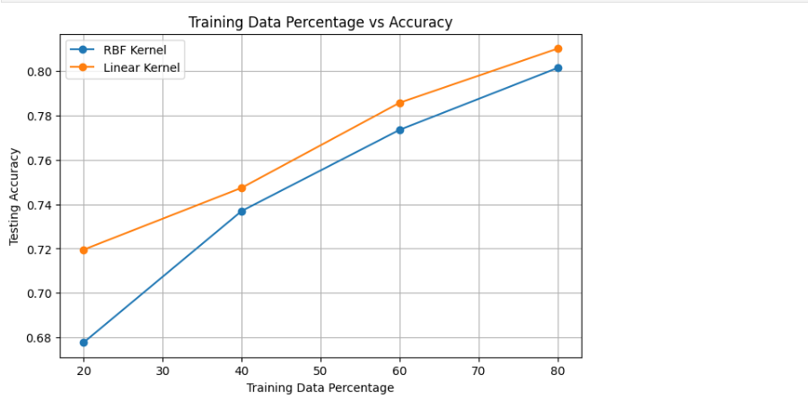

---

## RBF Performance Metrics

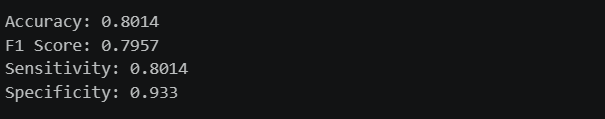

---

## Linear Performance Metrics

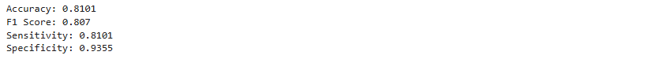

---

## Histogram

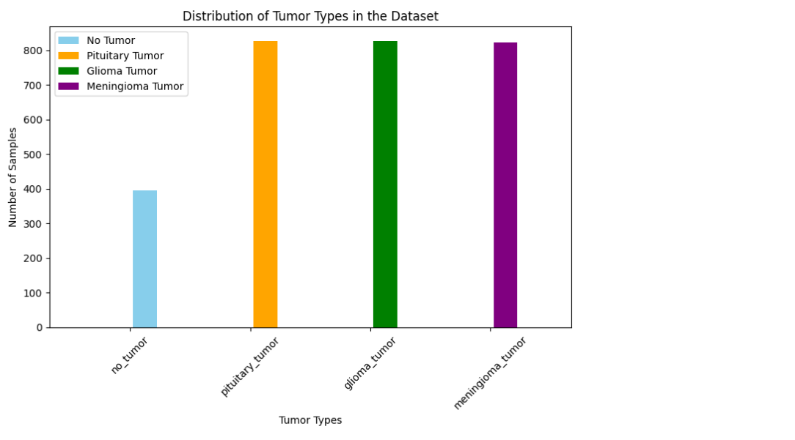

---

# Exercise-2: Chest X-Ray Classification using CNN

## Project Description

The objective of this project is to classify chest X-Ray scans into:

* NORMAL
* PNEUMONIA

### Method Used

* Image preprocessing
* Image normalization
* Data augmentation
* MobileNet CNN Architecture
* Binary Classification
* Model Checkpointing
* Reproducible Training Pipeline

---

## Project Files

### Code

[View Notebook on GitHub](./Exersize-2%28ChestXRay%29/Code/ChestXRay_CNN.ipynb)

---

# Results

# Baseline CNN

## Total Image Count

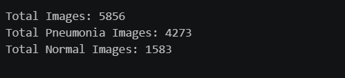

---

## Train Test Validation Split Count

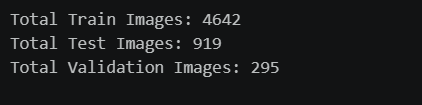

---

## Preprocessed Training Images

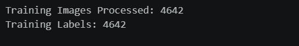

---

## Class Distribution

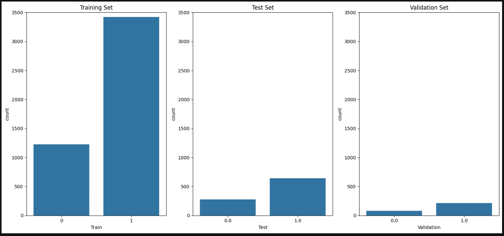

---

## Sample Images

### Training Samples

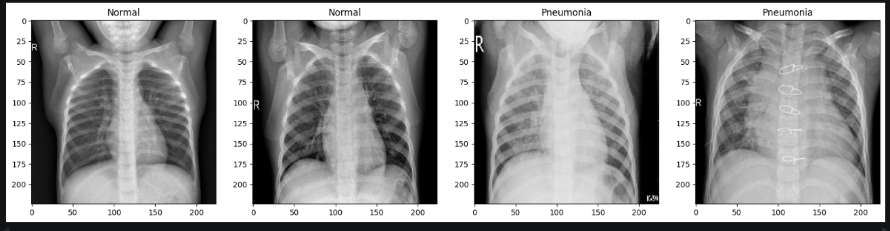

### Testing Samples

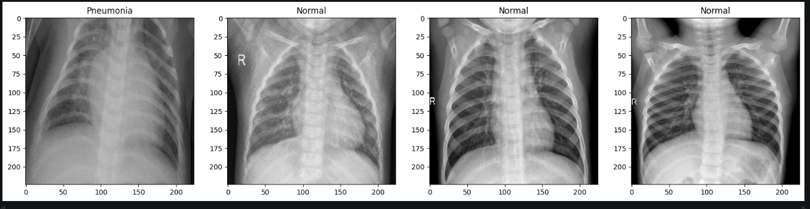

### Validation Samples

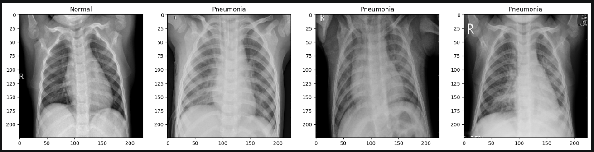

---

## Initial CNN Training

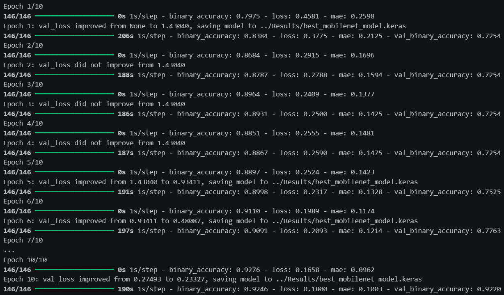

---

## Training and Validation Accuracy

---

## Training and Validation Loss

---

## Performance Metrics

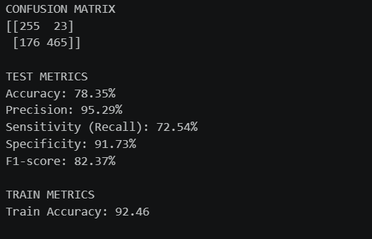

---

## Confusion Matrix

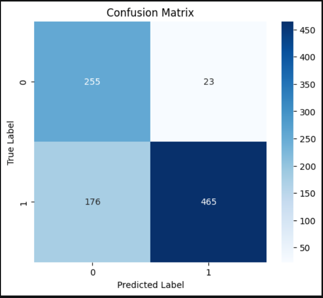

---

## ROC Curve

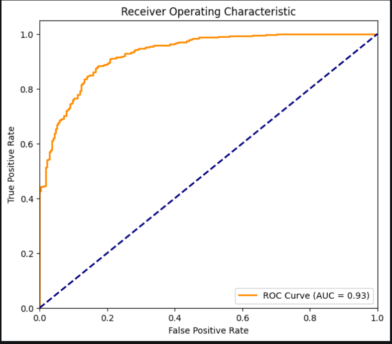

---

## Model Configuration

* Architecture: MobileNet
* Input Size: 224 × 224 × 3
* Optimizer: Adam
* Loss Function: Binary Crossentropy
* Batch Size: 32
* Epochs: 10 (Baseline)
* Augmentation: Enabled
* Model Saving: Best Validation Loss Checkpoint

---

## Baseline Performance Summary

* Accuracy: 78.35%
* Precision: 95.29%
* Sensitivity (Recall): 72.54%
* Specificity: 91.73%
* F1 Score: 82.37%
* AUC Score: 0.93

---

# Future Work

## Transfer Learning

(To be implemented)

---

## Training Percentage Experiments

### 20 Percent Training Data

(To be implemented)

### 40 Percent Training Data

(To be implemented)

### 60 Percent Training Data

(To be implemented)

### 80 Percent Training Data

(To be implemented)

---

## CNN vs SVM Comparison

(To be implemented)

---

## Detailed Final Report

(To be implemented)

---

# Future Exercises

Exercise-3: XGBoost for Medical Image Classification
